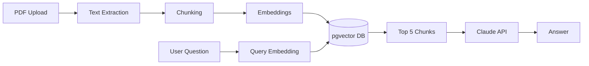

# 🦆 Assistant-Duck

> RAG assistant for analyzing and querying PDFs. Upload your PDF and ask whatever you need — the assistant answers with the most relevant information, strictly within the context of the document.

**🔗 [Live Demo](https://rag-document-assistant-mu.vercel.app)**

## Screenshots

## Features

- 📄 Upload PDFs via drag & drop or file picker
- 💬 Chat with your documents in natural language
- 🔍 Semantic search powered by vector embeddings
- 🎯 Answers grounded strictly in document content
- 🗂️ Manage the shared document library: view and delete
- ⚡ Markdown-formatted responses with loading states

## Tech Stack

**Backend**
- FastAPI (Python)
- Uvicorn (ASGI server)
- PostgreSQL + pgvector (vector similarity search)
- SQLAlchemy (ORM)
- Pydantic (data validation)
- pypdf (PDF text extraction)
- sentence-transformers (`all-MiniLM-L6-v2` for local embeddings)
- Anthropic Claude API (LLM)
- pytest (testing)

**Frontend**
- React 19 + TypeScript
- Vite
- Tailwind CSS
- React Router
- Axios
- react-markdown (rendering formatted AI responses)

**Infrastructure & Deployment**
- Docker (local PostgreSQL with pgvector)
- Railway (backend + database)
- Vercel (frontend)

## How It Works

Assistant-Duck uses a Retrieval-Augmented Generation (RAG) pipeline to answer questions based strictly on the content of your documents:

1. **Upload & extract** — Text is extracted from the PDF using `pypdf`.
2. **Chunking** — The text is split into 500-character chunks with 100-character overlap to preserve context across boundaries (chunks under 50 chars are discarded).
3. **Embeddings** — Each chunk is converted into a 384-dimension vector using a local `sentence-transformers` model (`all-MiniLM-L6-v2`).
4. **Storage** — Chunks and embeddings are stored in PostgreSQL via the `pgvector` extension.
5. **Retrieval** — Your question is embedded the same way, and pgvector finds the 5 most similar chunks using cosine distance.
6. **Generation** — Those chunks are passed as context to Claude, which generates an answer grounded only in the retrieved content.